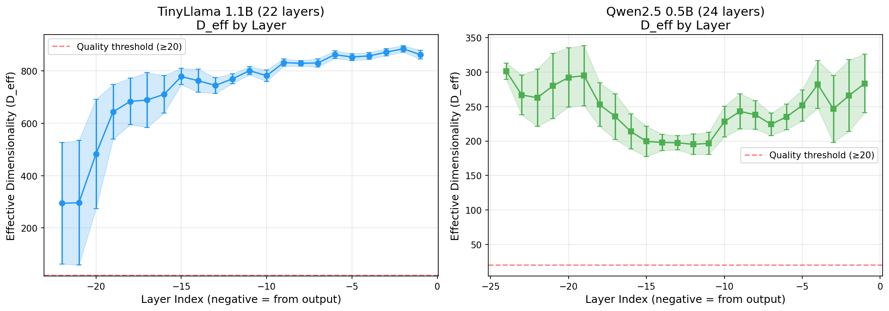
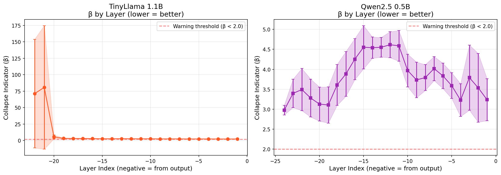
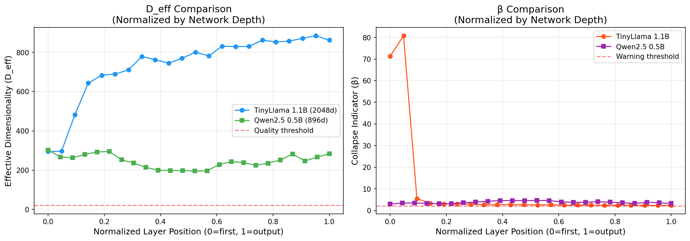

# The Loom

**Hidden state extraction for transformer models** - the capability that production inference servers don't provide.

> **⚠️ Research Tool - Not for Production**
>
> The Loom is designed for **ML research and experimentation**, not production deployments. Use it for:
> - Local development and prototyping
> - Cloud-based research (RunPod, Lambda Labs, etc.)
> - Interpretability and alignment research
> - Model analysis and comparison
>
> For production inference, use [vLLM](https://github.com/vllm-project/vllm), [TGI](https://github.com/huggingface/text-generation-inference), or similar optimized servers.

## The Problem

Production inference servers (vLLM, Ollama, TGI, llama.cpp) are optimized for throughput. They don't expose the final hidden state - the geometric representation of meaning *before* text generation.

```text
Input → [Transformer Layers] → Hidden State → [lm_head] → Logits → Tokens
                                    ↑
                          THE LOOM EXPOSES THIS
```

If you've been waiting for [vLLM #6165](https://github.com/vllm-project/vllm/issues/6165), [#12249](https://github.com/vllm-project/vllm/issues/12249), or similar issues to be resolved - The Loom is for you.

## Quick Start (Docker)

```bash
# Pull and run (requires nvidia-docker)
docker run -d --gpus all -p 8080:8080 \
  -v ~/.cache/huggingface:/app/.cache/huggingface \
  tbucy/loom:latest

# Generate with hidden states
curl -X POST http://localhost:8080/generate \
  -H "Content-Type: application/json" \
  -d '{
    "model": "mistralai/Mistral-7B-Instruct-v0.3",
    "prompt": "What is the meaning of life?",
    "max_tokens": 50,
    "return_hidden_states": true
  }'
```

## Model Compatibility

Tested and working:

| Model Family | Example | Hidden Size | Status |
|-------------|---------|-------------|--------|
| **Llama** | `meta-llama/Llama-3.1-8B-Instruct` | 4096 | ✅ |
| **Mistral** | `mistralai/Mistral-7B-Instruct-v0.3` | 4096 | ✅ |
| **Qwen** | `Qwen/Qwen2.5-7B-Instruct` | 3584 | ✅ |
| **TinyLlama** | `TinyLlama/TinyLlama-1.1B-Chat-v1.0` | 2048 | ✅ |
| **Embedding Models** | `BAAI/bge-small-en-v1.5` | 384 | ✅ |

Most HuggingFace transformer models should work. The Loom auto-detects the appropriate loader.

## API Reference

### POST /generate

Generate text with hidden state extraction.

**Request:**

```json
{
  "model": "mistralai/Mistral-7B-Instruct-v0.3",
  "prompt": "Hello, how are you?",
  "max_tokens": 256,
  "temperature": 0.7,
  "return_hidden_states": true,
  "hidden_state_layers": [-1]
}
```

**hidden_state_layers options:**
- `[-1]` - Last layer only (default, semantic representation)
- `[-1, -2, -3]` - Specific layers (negative indices from end)
- `"all"` - Every layer in the model (for layer-wise analysis)

**Response:**

```json
{
  "text": "I'm doing well, thank you for asking!",
  "token_count": 8,
  "hidden_states": {
    "-1": {
      "data": [0.123, -0.456, ...],
      "shape": [1, 4096],
      "dtype": "float32"
    }
  },
  "metadata": {
    "inference_time_ms": 234,
    "tokens_per_second": 34.2
  }
}
```

### POST /embed

Extract embeddings with configurable pooling.

```json
{
  "model": "BAAI/bge-small-en-v1.5",
  "text": "Hello world",
  "pooling": "mean",
  "normalize": true
}
```

### POST /v1/chat/completions (WeaverCode Integration)

OpenAI-compatible chat completions with hidden state extraction. Designed for integration with [WeaverCode](https://github.com/r3d91ll/weaver-code) and other AI orchestration tools.

**Request:**
```json
{
  "model": "TinyLlama/TinyLlama-1.1B-Chat-v1.0",
  "messages": [
    {"role": "system", "content": "You are a helpful assistant."},
    {"role": "user", "content": "Hello!"}
  ],
  "max_tokens": 256,
  "temperature": 0.7,
  "return_hidden_states": true
}
```

**Response:**
```json
{
  "text": "Hello! How can I help you today?",
  "usage": {
    "prompt_tokens": 45,
    "completion_tokens": 12,
    "total_tokens": 57
  },
  "hidden_state": {
    "final": [0.123, -0.456, ...],
    "shape": [1, 2048],
    "layer": -1,
    "dtype": "float16"
  },
  "metadata": {
    "model": "TinyLlama/TinyLlama-1.1B-Chat-v1.0",
    "latency_ms": 1234.5,
    "tokens_per_second": 45.2
  }
}
```

Key features:
- **Chat template support**: Automatically applies model-specific chat templates
- **Token usage breakdown**: Separate prompt/completion token counts
- **Hidden state in WeaverCode format**: `hidden_state.final` contains the boundary object vector

### POST /v1/generate

Alias for `/generate` with `/v1/` prefix for API consistency.

### POST /generate/stream

Server-sent events streaming with optional hidden states at completion.

### POST /generate/batch & /embed/batch

Batch processing for multiple prompts/texts.

### GET /health

Health check with GPU info and loaded models.

### GET /models

List currently loaded models with details.

### POST /models/load

Preload a model into memory.

```json
{
  "model": "meta-llama/Llama-3.1-8B-Instruct",
  "device": "cuda:0",
  "quantization": "4bit"
}
```

### DELETE /models/{model_id}

Unload a model from memory.

### GET /loaders

List available loaders and their fallback order.

### GET /loaders/probe/{model_id}

Check which loader would handle a model without loading it.

## Installation

### Docker (Recommended)

```bash
# Basic usage (lazy loading - models load on first request)
docker run -d --gpus all -p 8080:8080 tbucy/loom:latest

# With persistent model cache (recommended)
docker run -d --gpus all -p 8080:8080 \
  -v ~/.cache/huggingface:/app/.cache/huggingface \
  tbucy/loom:latest

# With specific GPU
docker run -d --gpus '"device=0"' -p 8080:8080 \
  -e CUDA_VISIBLE_DEVICES=0 \
  tbucy/loom:latest

# With HuggingFace token for gated models
docker run -d --gpus all -p 8080:8080 \
  -e HF_TOKEN=your_token_here \
  -v ~/.cache/huggingface:/app/.cache/huggingface \
  tbucy/loom:latest
```

### Cloud Deployment with Preloaded Model

For cloud deployments (RunPod, Lambda Labs, AWS, etc.), preload your model at startup so it's ready immediately:

```bash
# Preload a specific model at container startup
docker run -d --gpus all -p 8080:8080 \
  -v ~/.cache/huggingface:/app/.cache/huggingface \
  tbucy/loom:latest \
  sh -c "python -m src.server --host 0.0.0.0 --port 8080 --preload mistralai/Mistral-7B-Instruct-v0.3"

# Preload multiple models (if you have enough VRAM)
docker run -d --gpus all -p 8080:8080 \
  -v ~/.cache/huggingface:/app/.cache/huggingface \
  tbucy/loom:latest \
  sh -c "python -m src.server --host 0.0.0.0 --port 8080 \
    --preload mistralai/Mistral-7B-Instruct-v0.3 \
    --preload BAAI/bge-small-en-v1.5"

# With quantization for larger models on limited VRAM
docker run -d --gpus all -p 8080:8080 \
  -e HF_TOKEN=your_token_here \
  -v ~/.cache/huggingface:/app/.cache/huggingface \
  tbucy/loom:latest \
  sh -c "python -m src.server --host 0.0.0.0 --port 8080 --preload meta-llama/Llama-3.1-8B-Instruct"
```

### Docker Compose

```yaml
services:
  loom:
    image: tbucy/loom:latest
    ports:
      - "8080:8080"
    environment:
      - LOOM_MAX_MODELS=2
      - LOOM_DEFAULT_DEVICE=cuda:0
    volumes:
      - ~/.cache/huggingface:/app/.cache/huggingface
    deploy:
      resources:
        reservations:
          devices:
            - driver: nvidia
              count: 1
              capabilities: [gpu]
```

**Docker Compose with preloaded model:**

```yaml
services:
  loom:
    image: tbucy/loom:latest
    ports:
      - "8080:8080"
    environment:
      - LOOM_MAX_MODELS=1
      - LOOM_DEFAULT_DEVICE=cuda:0
      - HF_TOKEN=${HF_TOKEN}  # For gated models
    volumes:
      - ~/.cache/huggingface:/app/.cache/huggingface
    # Override command to preload model at startup
    command: >
      sh -c "python -m src.server --host 0.0.0.0 --port 8080
      --preload mistralai/Mistral-7B-Instruct-v0.3"
    deploy:
      resources:
        reservations:
          devices:
            - driver: nvidia
              count: 1
              capabilities: [gpu]
```

### From Source

```bash
git clone https://github.com/r3d91ll/The_Loom.git
cd The_Loom
poetry install
poetry run loom --port 8080
```

#### Transport Options (Local Install)

When running from source, The Loom supports multiple transport modes:

```bash
# HTTP server (default) - accessible over network
poetry run loom --transport http --port 8080

# Unix socket - faster IPC for local applications
poetry run loom --transport unix --unix-socket /tmp/loom.sock

# Both HTTP and Unix socket simultaneously
poetry run loom --transport both --port 8080 --unix-socket /tmp/loom.sock
```

**When to use Unix sockets:**

- Local applications on the same machine (lower latency than HTTP)
- High-frequency requests from co-located processes
- Pipelines where The Loom runs alongside your analysis code

**Connecting via Unix socket (Python):**

```python
import httpx

# Using httpx with Unix socket transport
transport = httpx.HTTPTransport(uds="/tmp/loom.sock")
client = httpx.Client(transport=transport, base_url="http://localhost")

response = client.post("/generate", json={
    "model": "mistralai/Mistral-7B-Instruct-v0.3",
    "prompt": "Hello world",
    "return_hidden_states": True,
})
```

> **Note:** Unix socket transport is only available for local/source installs. Docker deployments use HTTP.

## Model Loading

Unlike vLLM which requires declaring a model at startup, The Loom supports **both** approaches:

### Preload at Startup (vLLM-style)

```bash
# CLI: Preload specific model(s) before accepting requests
poetry run loom --preload meta-llama/Llama-3.1-8B-Instruct

# Multiple models
poetry run loom --preload mistralai/Mistral-7B-Instruct-v0.3 --preload BAAI/bge-small-en-v1.5

# Docker: Override CMD to preload
docker run -d --gpus all -p 8080:8080 \
  -v ~/.cache/huggingface:/app/.cache/huggingface \
  tbucy/loom:latest \
  sh -c "python -m src.server --preload meta-llama/Llama-3.1-8B-Instruct"
```

### Lazy Load on Demand (Default)

Models are loaded automatically on first request. This is useful for:
- Multi-model workflows where you don't know which models you'll need
- Memory-constrained environments (only load what you use)
- Development and experimentation

```bash
# Start server with no models loaded
poetry run loom --port 8080

# First request to a model triggers loading
curl -X POST http://localhost:8080/generate \
  -d '{"model": "mistralai/Mistral-7B-Instruct-v0.3", "prompt": "Hello"}'
```

### LRU Model Eviction

The Loom maintains up to `LOOM_MAX_MODELS` in memory (default: 3). When the limit is reached, the least-recently-used model is evicted to make room for new ones.

```bash
# Allow more models in memory
LOOM_MAX_MODELS=5 poetry run loom
```

### Auto-Unload Idle Models

Models are automatically unloaded after a period of inactivity (default: 20 minutes). This frees GPU memory without manual intervention.

```yaml
# config.yaml
models:
  auto_unload_minutes: 20  # Set to 0 to disable
```

Check idle status via the `/models` endpoint:

```json
{
  "loaded_models": [
    {
      "model_id": "TinyLlama/TinyLlama-1.1B-Chat-v1.0",
      "idle_seconds": 45.2,
      "auto_unload_in": 1154.8
    }
  ],
  "auto_unload_minutes": 20
}
```

- `idle_seconds`: Time since last request to this model
- `auto_unload_in`: Seconds until auto-unload (null if disabled)

## Configuration

Environment variables:

| Variable | Default | Description |
|----------|---------|-------------|
| `LOOM_PORT` | 8080 | HTTP port |
| `LOOM_HOST` | 0.0.0.0 | Bind address |
| `LOOM_MAX_MODELS` | 3 | Max models in memory (LRU eviction) |
| `LOOM_AUTO_UNLOAD_MINUTES` | 20 | Auto-unload idle models (0 = disabled) |
| `LOOM_DEFAULT_DEVICE` | cuda:0 | Default GPU device |
| `LOOM_MEMORY_FRACTION` | 0.9 | GPU memory fraction to use |
| `HF_TOKEN` | - | HuggingFace token for gated models |

Or use a config file at `~/.config/loom/config.yaml`:

```yaml
server:
  http_port: 8080

gpu:
  devices: [0, 1]
  default_device: 0
  memory_fraction: 0.9

models:
  max_loaded: 3
  default_dtype: auto
  auto_unload_minutes: 20  # 0 to disable

hidden_states:
  default_layers: [-1]
  precision: float32
```

## Multi-Loader Architecture

The Loom automatically selects the best loader for each model:

| Loader | Coverage | Models |
|--------|----------|--------|
| `transformers` | ~80% | LLaMA, Mistral, Qwen, Phi, GPT-2, etc. |
| `sentence_transformers` | ~15% | BGE, E5, SBERT, GTE, etc. |
| `custom` | ~5% | Research models, custom architectures |

Override auto-detection with the `loader` parameter in requests.

## Quantization Support

Load models with reduced memory using quantization:

```json
{
  "model": "meta-llama/Llama-3.1-8B-Instruct",
  "quantization": "4bit"
}
```

Supported modes: `4bit`, `8bit`, `gptq`, `awq`

Requires `bitsandbytes` for 4bit/8bit (included in Docker image).

## Example Outputs

Real outputs from integration tests showing the actual format and data.

### Hidden State Extraction (Generation)

```json
{
  "request": {
    "model": "TinyLlama/TinyLlama-1.1B-Chat-v1.0",
    "prompt": "The meaning of life is",
    "max_tokens": 20,
    "return_hidden_states": true,
    "hidden_state_layers": [-1]
  },
  "response": {
    "text": "to have fun, while having fun you are having too much fun.",
    "token_count": 20,
    "hidden_states": {
      "-1": {
        "shape": [1, 2048],
        "dtype": "float16",
        "data": [1.601, 0.593, -1.214, 5.285, 1.337, -2.666, ...]
      }
    },
    "metadata": {
      "inference_time_ms": 509.13,
      "tokens_per_second": 39.28,
      "model_id": "TinyLlama/TinyLlama-1.1B-Chat-v1.0"
    }
  }
}
```

### All Layers Extraction

```json
{
  "request": {
    "hidden_state_layers": "all"
  },
  "response": {
    "num_layers_returned": 22,
    "layer_keys": ["-22", "-21", "-20", ..., "-2", "-1"],
    "first_layer_shape": [1, 2048],
    "last_layer_shape": [1, 2048]
  }
}
```

### Full Sequence Hidden States (for Manifold Analysis)

```json
{
  "request": {
    "return_full_sequence": true
  },
  "response": {
    "sequence_hidden_states": {
      "-1": {
        "shape": [5, 2048],
        "interpretation": "5 tokens × 2048 hidden dimensions"
      }
    }
  }
}
```

### Embedding Extraction

```json
{
  "request": {
    "model": "BAAI/bge-small-en-v1.5",
    "text": "The quick brown fox jumps over the lazy dog.",
    "pooling": "mean",
    "normalize": true
  },
  "response": {
    "shape": [384],
    "embedding": [-0.104, -0.013, -0.009, 0.107, ...],
    "l2_norm": 1.0
  }
}
```

### Base64 Format (Efficient Transfer)

For large hidden states, use `hidden_state_format: "base64"`:

```json
{
  "hidden_states": {
    "-1": {
      "shape": [1, 2048],
      "dtype": "float32",
      "encoding": "base64",
      "data": "AIBiPgAgIEAA4D2/AICIPwCgNz8..."
    }
  }
}
```

**Decoding in Python:**
```python
import base64
import numpy as np

decoded = base64.b64decode(layer_data['data'])
array = np.frombuffer(decoded, dtype=np.float32)
array = array.reshape(layer_data['shape'])
```

See `examples/outputs/` for complete sample responses from integration tests.

## Device Support

### Currently Supported

| Device Configuration | Status | Notes |
|---------------------|--------|-------|
| Single GPU | ✅ Full | Default `cuda:0`, specify others via `device` parameter |
| CPU Fallback | ✅ Auto | Falls back to CPU if no CUDA available |
| Specific GPU | ✅ Full | Use `device: "cuda:1"` in load request |
| Multi-GPU (quantized) | ✅ Auto | 4bit/8bit models auto-distribute via `device_map="auto"` |

**Examples:**

```bash
# Single GPU (default)
curl -X POST http://localhost:8080/models/load \
  -H "Content-Type: application/json" \
  -d '{"model": "mistralai/Mistral-7B-Instruct-v0.3"}'

# Specific GPU
curl -X POST http://localhost:8080/models/load \
  -H "Content-Type: application/json" \
  -d '{"model": "mistralai/Mistral-7B-Instruct-v0.3", "device": "cuda:1"}'

# Multi-GPU with quantization (auto-distributes)
curl -X POST http://localhost:8080/models/load \
  -H "Content-Type: application/json" \
  -d '{"model": "meta-llama/Llama-3.1-70B-Instruct", "quantization": "4bit"}'
```

### Not Currently Supported

| Feature | Status | Reason |
|---------|--------|--------|
| Multi-GPU (non-quantized) | ❌ | No tensor parallelism - full model on single GPU |
| Pipeline parallelism | ❌ | Not implemented |
| Explicit device_map control | ❌ | API doesn't expose HuggingFace device_map strategies |
| Multi-node inference | ❌ | Single-machine only |

## Known Limitations

**This is a research tool, not a production inference server.**

- **Throughput**: Optimized for hidden state access, not maximum tokens/second
- **Concurrency**: Single-request processing (no batched inference across requests)
- **Memory**: Non-quantized models load fully into single GPU (no tensor parallelism)
- **Chat Templates**: `/generate` endpoint uses raw prompts only; use `/v1/chat/completions` for automatic chat template application

For production inference without hidden states, use vLLM, TGI, or similar.

## Roadmap

Features under consideration for future releases:

- [ ] **Explicit device_map control** - Expose HuggingFace device_map strategies (`auto`, `balanced`, `sequential`)
- [ ] **Tensor parallelism** - Distribute large non-quantized models across multiple GPUs
- [ ] **Concurrent request handling** - Process multiple requests in parallel
- [ ] **OpenAI-compatible completions API** - `/v1/completions` endpoint for drop-in compatibility (chat completions already supported)
- [ ] **Attention weight extraction** - Return attention patterns alongside hidden states

Want to contribute? See [CONTRIBUTING.md](CONTRIBUTING.md) or open an issue.

## Demo: Geometric Analysis

The Loom includes a demo that showcases multi-GPU hidden state extraction with geometric analysis. See `demo/` for complete scripts and pre-generated outputs.

### Running the Demo

```bash
# Run geometric analysis on two models (requires 2 GPUs)
poetry run python demo/run_geometric_analysis.py

# Generate visualizations from existing data
poetry run python demo/generate_visualizations.py
```

### Sample Visualizations

The demo extracts hidden states from **all layers** of two models running on separate GPUs, then computes geometric metrics:

**D_eff (Effective Dimensionality) by Layer:**



**β (Collapse Indicator) by Layer:**



**Model Comparison (Normalized):**



### Key Metrics

| Metric | TinyLlama 1.1B | Qwen2.5 0.5B |
|--------|---------------|--------------|
| Hidden Size | 2048 | 896 |
| Layers | 22 | 24 |
| Mean D_eff | 724.60 | 237.45 |
| Mean β | 9.46 | 4.01 |

- **D_eff** (Effective Dimensionality): Semantic richness of representations (higher = better)
- **β** (Collapse Indicator): Dimensional compression diagnostic (lower = better)

See `demo/outputs/metrics_summary.md` for complete analysis.

## Use Cases

- **Interpretability Research**: Analyze internal representations during generation
- **Embedding Extraction**: Get hidden states instead of just final embeddings
- **Model Comparison**: Compare geometric representations across models
- **Alignment Research**: Study how representations change with prompts
- **Probing Classifiers**: Train classifiers on intermediate representations

## Python Client

```python
import httpx

client = httpx.Client(base_url="http://localhost:8080")

# Generate with hidden states
response = client.post("/generate", json={
    "model": "mistralai/Mistral-7B-Instruct-v0.3",
    "prompt": "Explain quantum computing:",
    "max_tokens": 100,
    "return_hidden_states": True,
})

result = response.json()
print(f"Text: {result['text']}")
print(f"Hidden state shape: {result['hidden_states']['-1']['shape']}")
```

## Layer-by-Layer Analysis

The Loom supports extraction of hidden states from any transformer layer, enabling interpretability research, probing experiments, and analysis of how information flows through the model.

### The `hidden_state_layers` Parameter

Control which layers to extract hidden states from:

| Value | Description | Use Case |
|-------|-------------|----------|
| `[-1]` | Last layer only (default) | Final semantic representation for embedding tasks |
| `[-1, -2, -3]` | Specific layers (negative indexing) | Compare early vs. late representations |
| `[0, 6, 11]` | Specific layers (positive indexing) | Target specific transformer blocks |
| `"all"` | Every layer in the model | Full layer-by-layer analysis, D_eff computation |

**Negative vs. Positive Indexing:**
- **Negative indices** (e.g., `-1`, `-2`) count from the final layer backwards, which is portable across models of different depths
- **Positive indices** (e.g., `0`, `5`, `11`) count from the first layer, useful when targeting specific architectural positions

### Extracting All Layers

Use `hidden_state_layers: "all"` to extract hidden states from every transformer layer:

```bash
curl -X POST http://localhost:8080/generate \
  -H "Content-Type: application/json" \
  -d '{
    "model": "TinyLlama/TinyLlama-1.1B-Chat-v1.0",
    "prompt": "The meaning of life is",
    "max_tokens": 20,
    "return_hidden_states": true,
    "hidden_state_layers": "all"
  }'
```

**Response structure:**

```json
{
  "text": "to have fun, while having fun you are having too much fun.",
  "token_count": 20,
  "hidden_states": {
    "-22": { "shape": [1, 2048], "dtype": "float16", "data": [...] },
    "-21": { "shape": [1, 2048], "dtype": "float16", "data": [...] },
    "-20": { "shape": [1, 2048], "dtype": "float16", "data": [...] },
    "...": "...",
    "-2": { "shape": [1, 2048], "dtype": "float16", "data": [...] },
    "-1": { "shape": [1, 2048], "dtype": "float16", "data": [...] }
  },
  "metadata": {
    "inference_time_ms": 892.45,
    "tokens_per_second": 22.41
  }
}
```

**Notes:**
- All layer keys use negative indexing (e.g., `-22` is the first layer, `-1` is the last layer for a 22-layer model)
- Extracting all layers increases response size and memory usage proportionally
- For large models, consider extracting a subset of layers or using `hidden_state_format: "base64"`

### Understanding D_eff (Effective Dimensionality)

D_eff measures how many dimensions are actively used in a hidden state representation. It's computed from the singular value distribution of the hidden state matrix.

**Formula:**
```
D_eff = exp(H) where H = -Σ(p_i × log(p_i))
p_i = σ_i² / Σ(σ_j²)  (normalized squared singular values)
```

**Interpretation Guide:**

| D_eff Range | Interpretation | Implications |
|-------------|----------------|--------------|
| **High D_eff** (near hidden_dim) | Information distributed across many dimensions | Rich, diverse representations; higher semantic capacity |
| **Medium D_eff** (50-80% of hidden_dim) | Typical for well-trained models | Balanced compression and expressiveness |
| **Low D_eff** (< 50% of hidden_dim) | Information concentrated in few dimensions | Possible dimensional collapse; less semantic richness |

**Layer-by-Layer Patterns:**

Typical transformer models exhibit characteristic D_eff patterns:

1. **Early layers** (low layer index): Higher D_eff, preserving input diversity
2. **Middle layers**: Gradual compression as abstract features form
3. **Final layers**: Task-specific representations, D_eff depends on task

**Example D_eff Values (TinyLlama 1.1B):**

| Layer | D_eff | % of Hidden Dim (2048) |
|-------|-------|------------------------|
| -22 (first) | 842.3 | 41.1% |
| -11 (middle) | 756.8 | 36.9% |
| -1 (last) | 689.2 | 33.6% |

### Computing D_eff from Hidden States

```python
import numpy as np

def compute_deff(hidden_states: np.ndarray) -> float:
    """
    Compute effective dimensionality (D_eff) from hidden states.

    Args:
        hidden_states: Array of shape [batch, hidden_dim] or [hidden_dim]

    Returns:
        D_eff value (float)
    """
    if hidden_states.ndim == 1:
        hidden_states = hidden_states.reshape(1, -1)

    # Compute singular values
    _, singular_values, _ = np.linalg.svd(hidden_states, full_matrices=False)

    # Normalize squared singular values to get probability distribution
    squared_sv = singular_values ** 2
    probabilities = squared_sv / squared_sv.sum()

    # Remove zeros to avoid log(0)
    probabilities = probabilities[probabilities > 1e-10]

    # Compute entropy
    entropy = -np.sum(probabilities * np.log(probabilities))

    # D_eff is the exponential of entropy
    return float(np.exp(entropy))


# Example: Compute D_eff for each layer
import httpx

response = httpx.post("http://localhost:8080/generate", json={
    "model": "TinyLlama/TinyLlama-1.1B-Chat-v1.0",
    "prompt": "The meaning of life is",
    "max_tokens": 20,
    "return_hidden_states": True,
    "hidden_state_layers": "all"
})

result = response.json()

for layer_key, layer_data in sorted(result["hidden_states"].items(), key=lambda x: int(x[0])):
    hidden_state = np.array(layer_data["data"]).reshape(layer_data["shape"])
    deff = compute_deff(hidden_state)
    print(f"Layer {layer_key}: D_eff = {deff:.2f}")
```

### Research Applications

**Interpretability Research:**
- Track how specific concepts evolve through layers
- Identify which layers are most important for particular tasks
- Compare information flow between different model architectures

**Model Comparison:**
- Compare D_eff curves between models to assess representation quality
- Identify architectural differences in how models process information
- Benchmark fine-tuned vs. base models

**Probing Experiments:**
- Extract representations from specific layers for downstream classifiers
- Study where linguistic features emerge in the network
- Analyze attention patterns in conjunction with hidden states

See `demo/` for complete examples of multi-model geometric analysis.

## Development

```bash
# Install dev dependencies
poetry install

# Run tests
poetry run pytest

# Type checking
poetry run mypy src

# Linting
poetry run ruff check src tests
poetry run ruff format src tests
```

## Contributing

Contributions welcome! Areas where help is needed:

- Additional model family support
- Performance optimizations
- Documentation improvements
- Bug reports and fixes

## License

Apache-2.0

## Acknowledgments

Built with:

- [HuggingFace Transformers](https://github.com/huggingface/transformers)
- [FastAPI](https://fastapi.tiangolo.com/)
- [Sentence Transformers](https://www.sbert.net/)
