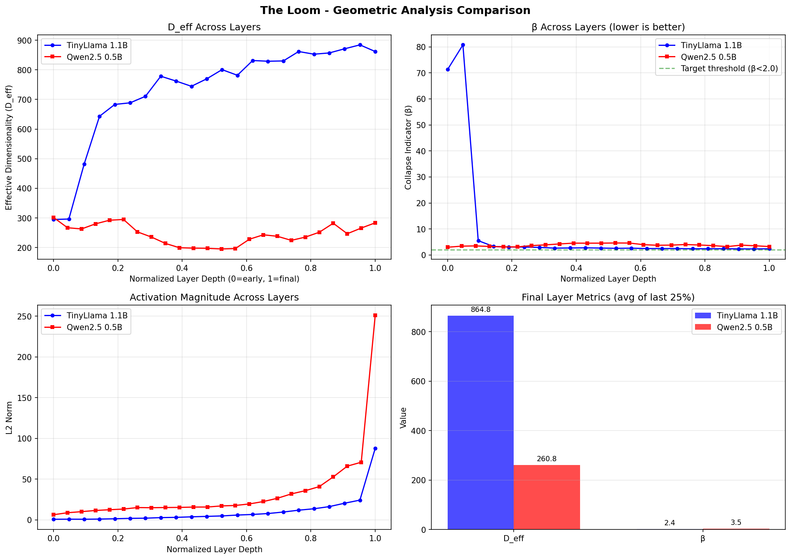

# The Loom - Geometric Analysis Results

## Overview

This analysis compares hidden state geometry between two transformer models,
demonstrating The Loom's capability to extract and analyze internal representations.

## Models Analyzed

| Property | TinyLlama 1.1B | Qwen2.5 0.5B |
|----------|--------------------------|--------------------------|
| Model ID | `TinyLlama/TinyLlama-1.1B-Chat-v1.0` | `Qwen/Qwen2.5-0.5B-Instruct` |
| Device | cuda:0 | cuda:1 |
| Layers | 22 | 24 |
| Hidden Size | 2048 | 896 |
| Load Time | 0.9s | 0.9s |

## Geometric Metrics

### Final Layer Metrics

| Metric | TinyLlama 1.1B | Qwen2.5 0.5B | Description |
|--------|--------------------------|--------------------------|-------------|
| D_eff | 861.8 | 283.4 | Effective dimensionality |
| β | 2.38 | 3.24 | Collapse indicator (lower is better) |

### Average Across All Layers

| Metric | TinyLlama 1.1B | Qwen2.5 0.5B |
|--------|--------------------------|--------------------------|
| Avg D_eff | 732.5 | 245.2 |
| Avg β | 9.43 | 3.78 |

## Visualization

## Interpretation

- **D_eff (Effective Dimensionality)**: Measures how many dimensions are actively used
  in the representation. Higher values indicate richer semantic encoding.

- **β (Collapse Indicator)**: Measures dimensional collapse. Values below 2.0 are
  generally healthy. High β suggests the model is compressing information too
  aggressively.

## Test Prompts Used

1. "Explain the concept of gravity in simple terms."
2. "Write a haiku about artificial intelligence."
3. "What are the main differences between Python and JavaScript?"
4. "Describe a beautiful sunset over the ocean."
5. "How does photosynthesis work in plants?"

## Files Generated

- `model_a/responses.json` - Generated text and metadata
- `model_a/hidden_states_prompt_*.npz` - Raw hidden states (numpy compressed)
- `model_a/layer_metrics.json` - Per-layer geometric metrics
- `model_b/` - Same structure for second model
- `analysis/geometric_comparison.png` - Visualization
- `analysis/metrics_summary.md` - This file

---

*Generated by The Loom - Hidden State Extraction for AI Research*
